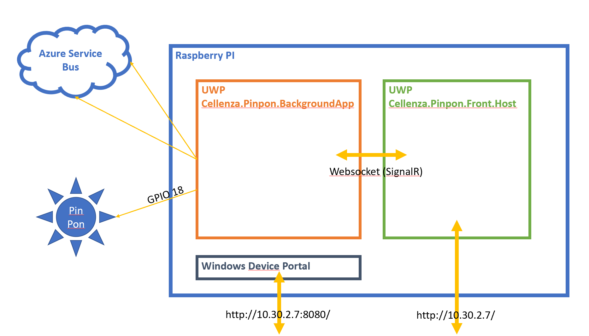
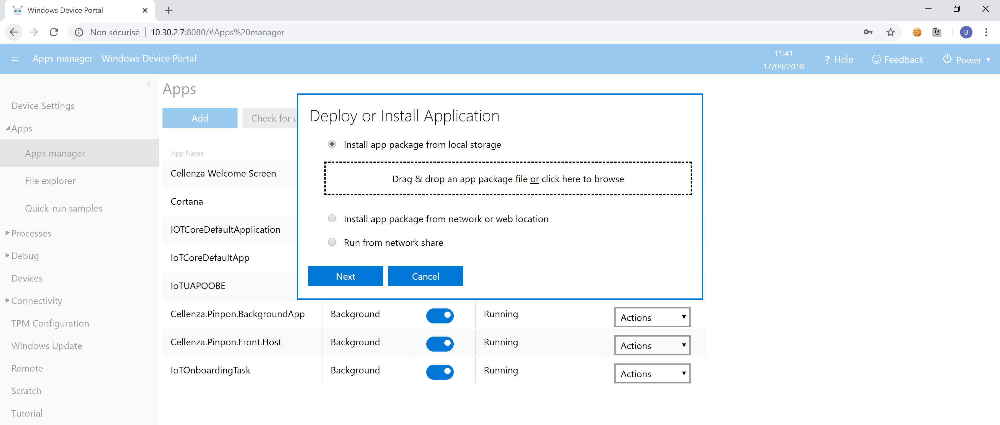

# Pinpon Project

Ce projet est utilisé au sein du studio de Cellenza, afin d'alerter les développeurs lorsqu'une build (du pipeline de build/release) d'un projet échoue.

- [Interface web du pinpon](./docs/Pinpon.md)
- [VSTS - Ajouter une nouvelle usine de build](./docs/VSTS.md)
- [Developement informations complémentaires](./docs/Development.md)

## React to build output

Afin de permettre au pinpon de pouvoir réagir aux différentes sortie de build produites. Celui-ci va devoir écouter ces mêmes sorties de build. Pour cela, un mécanisme à base de `Azure Service Bus` a été mise en place.

En effet, le mécanisme le plus simple que nous avons trouvé est d'utiliser le système de `hook` de VSTS. Celui-ci va donc pousser un nouvel event dans une queue Azure ([plus d'informations sur cette partie ici](./docs/VSTS.md)) lorsqu'une build se termine. Ensuite le pinpon va écouter sur cette même queue et à chaque nouvel event il :

- regarde s'il connait le projet
  - si oui il va mettre à jour le status de celui-ci
  - si non il l'ajoute à la liste des projets écoutés
- puis si parmis la liste des projets :
  - au moins un a un status `fail` il allume le pinpon
  - sinon il force l'extinction du pinpon

## Settings

Afin de faciliter l'utilisation du pinpon un portail web a été réalisé afin de réaliser certaines opérations :

- Allumer/Eteindre manuellement
- Ajouter/Désactiver une queue à écouter
- `TODO :` Regarder en live les logs produits par les deux applications

Sinon Microsoft propose une interface web de base pour administrer le raspberry sur le port `8080`

## Project architecture

Comme on peut le voir sur l'image ci-dessus, le fonctionnement du pinpon a été découpé en deux applications UWP distinctes. La première `BackgroundApp` a pour responsabilité d'allumer et éteindre physiquement parlant le pinpon, ainsi que d'écouter les différentes queues enregistrés. Celle-ci va récupérer sa configuration auprès de la seconde application (`Front.Host`) au travers d'une communication en websocket.

La seconde application `Front.Host` est une application UWP qui héberge et expose sur le port `80` une application en ASP .NET Core. Celle-ci permet d'éditer la configuration de la première application mais aussi d'intéragir directement pour allumer et éteindre le pinpon.

## Build and deployment

Le projet est donc composé de deux applications UWP, le déploiement est donc relativement simple à réaliser. Pour cela, il peut être fait soit à partir de Visual Studio (en faisant du déploiement à distance) soit en utilisant l'interface web fournis pour uploader les deux packages.

