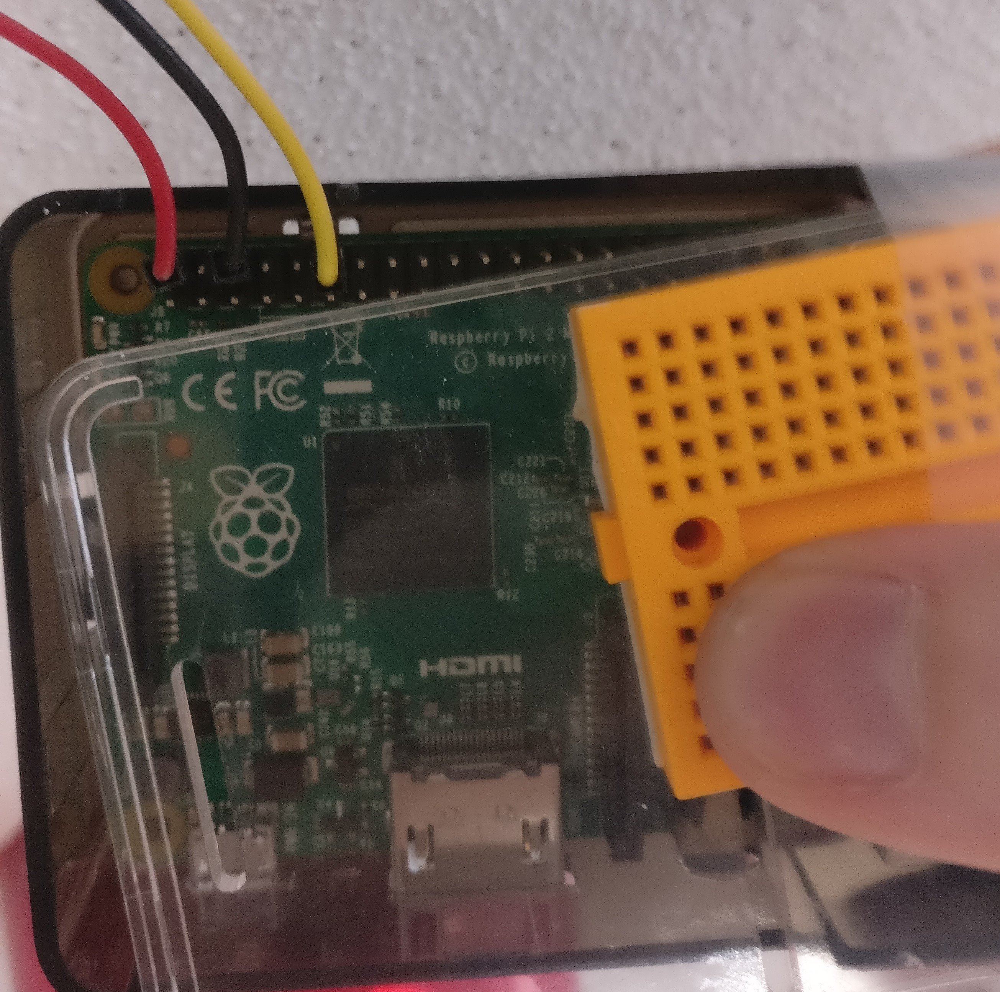

# Development Informations

## Hardware

### Pin Schema

- Relay +5V (Red)     : Raspberry pin 2
- Relay GND (Black)   : Raspberry pin 6
- Relay SIG (Yellow)  : Raspberry pin 12 (GPIO 18)

## Software

### Websocket

Activate local loopback to enable the two UWP app to communicate :
<https://docs.microsoft.com/en-us/windows/iot-core/develop-your-app/loopback>

### Debug with ETW

use theses guid to get logs :

- asp net core : 3ac73b97-af73-50e9-0822-5da4367920d0
- CLR provider : e13c0d23-ccbc-4e12-931b-d9cc2eee27e4
