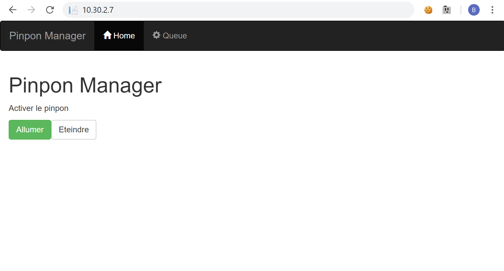
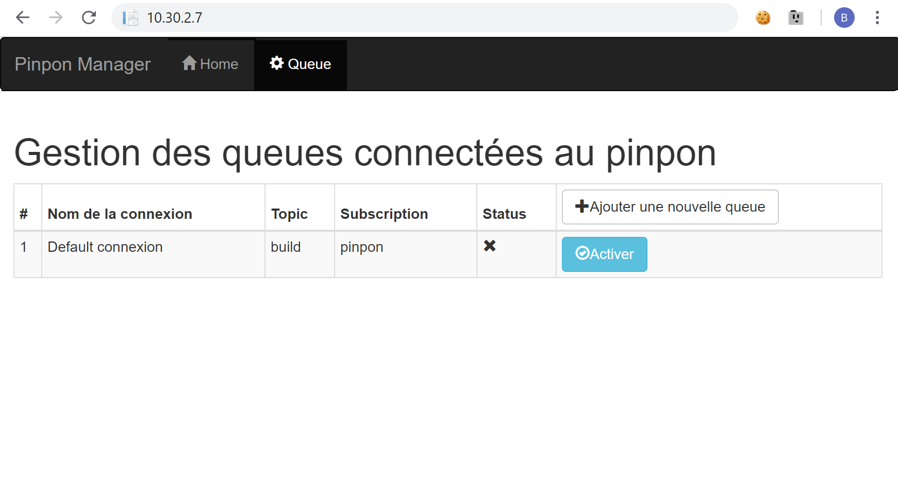
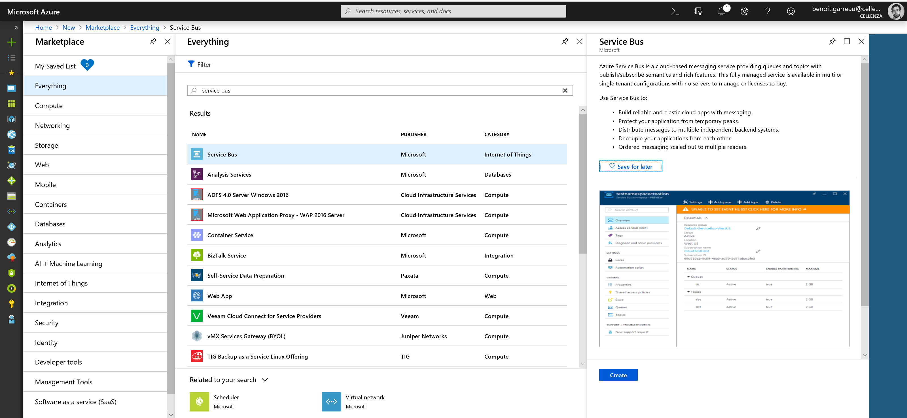
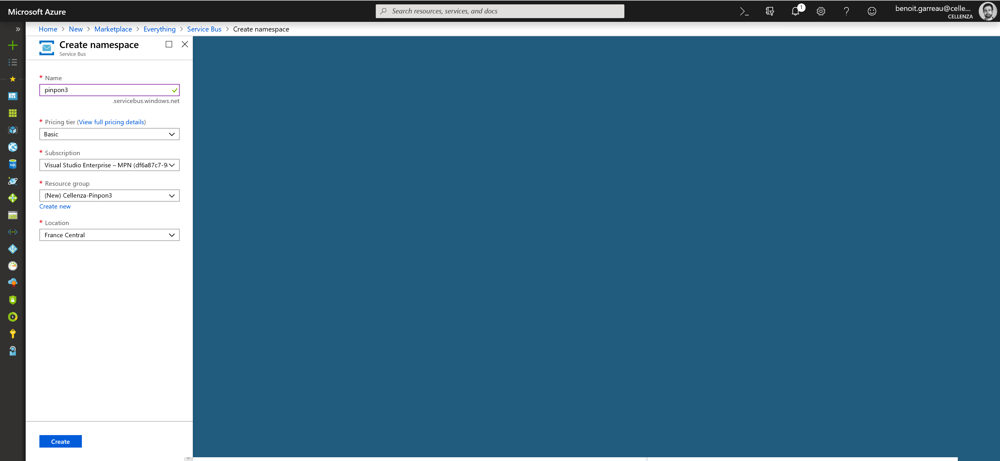
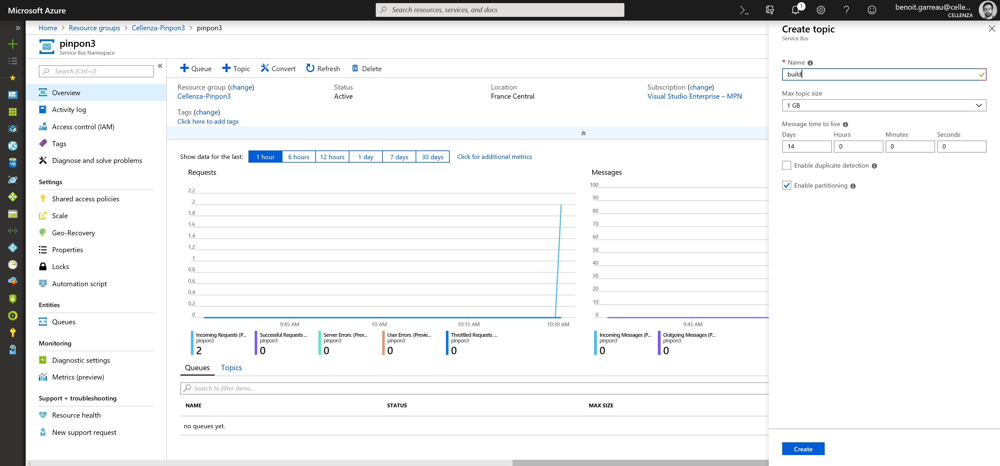
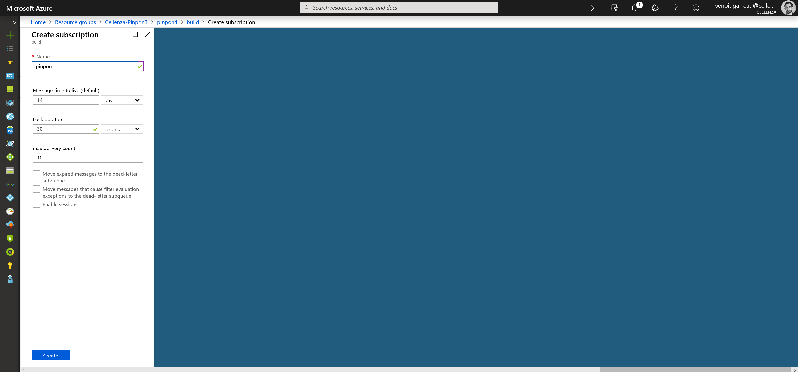
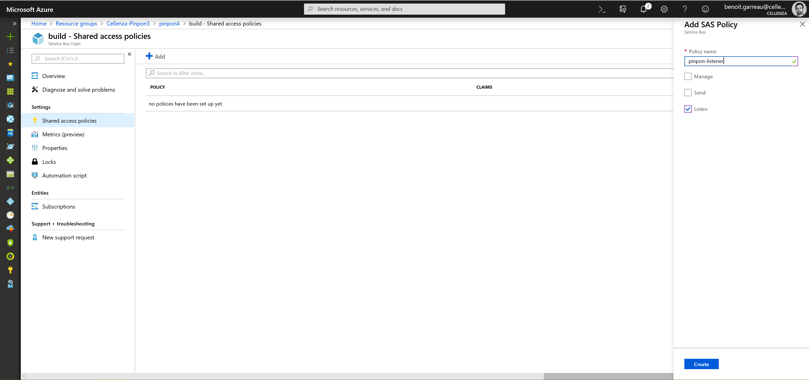
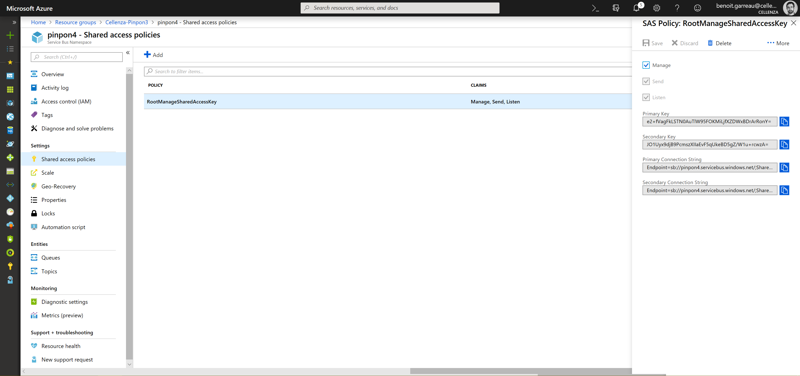
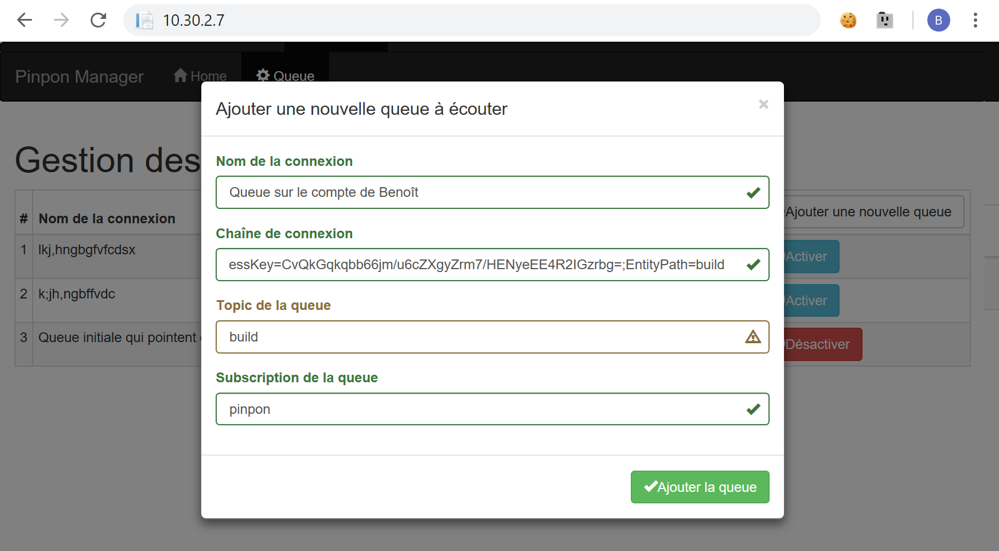

# Pinpon

Pour se connecter à l'interface, il faut aller à l'adresse <http://10.30.2.7/>

Une fois l'interface chargée, plusieurs écrans sont à votre disposition afin d'administrer celui-ci.

## Home

Sur la page d'accueil se trouve le bouton qui est sans aucun doute le plus important !

## Queue

La page Queue permet d'ajouter des Queues à poller pour le pinpon. Celle-ci permet donc :

- d'ajouter des queues
- de **désactiver** des queues

### Add new queue to poll

Pour ajouter une nouvelle queue à poller, il faut :

- créer une nouveau service bus sur Azure

- créer un nouveau Topic (si ce n'est pas possible il faut d'abord aller sur `scale > Messaging tier > Standard`)
  - **NB: il faut se garder le nom du topic pour la suite**

- créer une nouvelle subscription
  - **NB: il faut se garder le nom de la subscription pour la suite**

- créer une nouvelle paire de clés d'accès en **lecture** pour le **pinpon**
  - **NB: il faut se garder une des deux Connection String pour la suite**
  - **NB2: ⚠ Il ne faut pas inclure la variable `EntityPath=` de la connection string**

- Pour la clé SAS utilisé par les pipelines de build, pour envoyer les events, il faut récupérer la clé principale du Service Bus [cf doc](./VSTS.md)

- c'est tout pour la partie Azure, il faut maintenant se rendre sur la page d'administration du pinpon <http://10.30.2.7/queue> et rajouter la nouvelle queue avec les paramètres récupérés aux étapes précédentes

